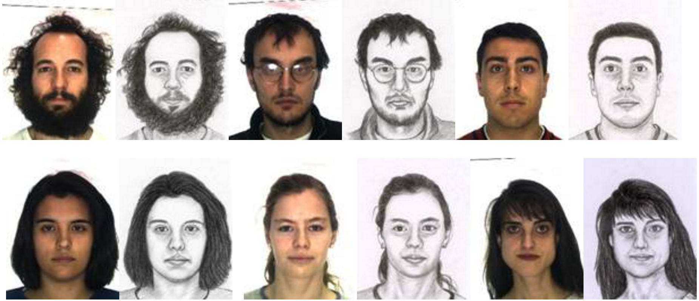
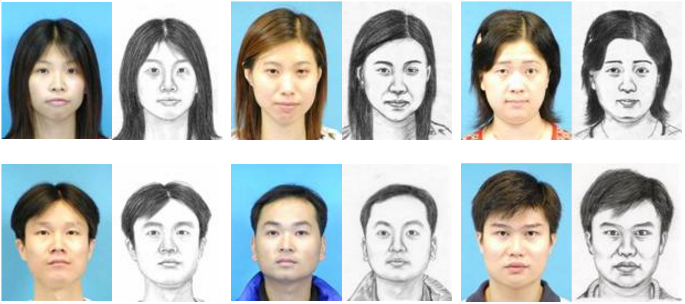
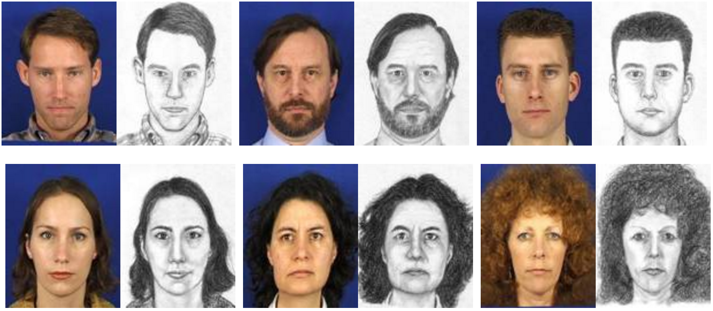

.. vim: set fileencoding=utf-8 :
.. @author: Tiago de Freitas Pereira <tiago.pereira@idiap.ch>
.. @date:   Fri 20 Nov 2015 16:54:53 CET 

.. _bob.db.cuhk_cufs:

=======================================
CUHK Face Sketch Database (CUFS)
=======================================

This package contains the access API and descriptions for the `CUHK Face Sketch Database (CUFS) <http://mmlab.ie.cuhk.edu.hk/archive/facesketch.html>`. 
The actual raw data for the database should be downloaded from the original URL. 
This package only contains the Bob accessor methods to use the DB directly from python, with the original protocol of the database.

CUHK Face Sketch Database (CUFS) is for research on face sketch synthesis and face sketch recognition.

It includes 188 faces from the Chinese University of Hong Kong (CUHK) student database, 123 faces from the AR database, and 295 faces from the XM2VTS database. 
There are 606 faces in total. For each face, there is a sketch drawn by an artist based on a photo taken in a frontal pose, under normal lighting condition and with a neutral expression. Follow below some pairs (photo and sketch) provided by the authors respectively from the ARFACE, CUHK Student database and XM2VTS:

|

|

If you use this package, please cite the authors of the database::

   @inproceedings{zhang2011coupled,
     title={Coupled information-theoretic encoding for face photo-sketch recognition},
     author={Zhang, Wei and Wang, Xiaogang and Tang, Xiaoou},
     booktitle={Computer Vision and Pattern Recognition (CVPR), 2011 IEEE Conference on},
     pages={513--520},
     year={2011},
     organization={IEEE}
   }

Documentation
-------------

.. toctree::
   :maxdepth: 2

   guide
   py_api

Indices and tables
------------------

* :ref:`genindex`
* :ref:`modindex`
* :ref:`search`

